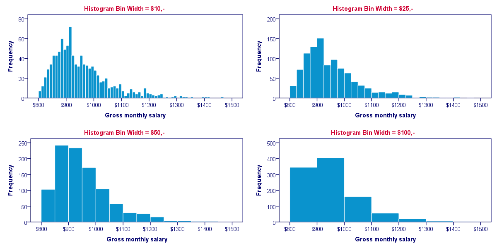
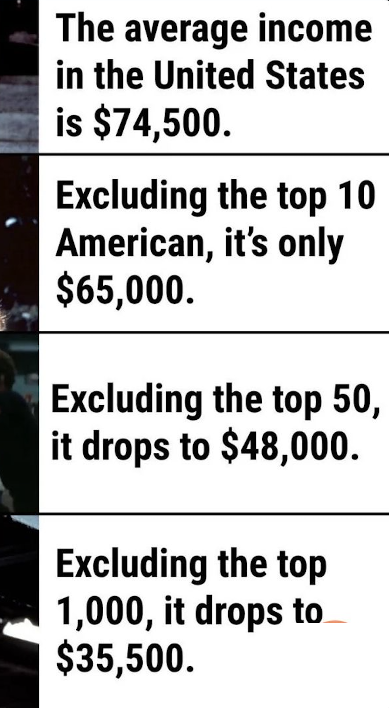
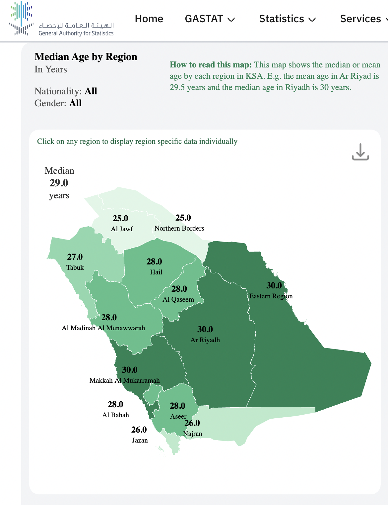

# Why Percentiles Win
## Why averages can be misleading in performance monitoring


---
transition: fade-out
level: 1
---

# A Tale of Misleading Averages

<div class="mt-8">
  <p class="text-gray-300 text-lg mb-6">Imagine you're monitoring an API. You get 10 requests with these response times:</p>
  
  <div v-click="1" class="mb-6">
    <div class="p-4 rounded-lg bg-gray-800/30">
```json
[100, 120, 110, 130, 115, 125, 105, 140, 150, 2000]
```
    </div>
  </div>

  <div v-click="2" class="grid md:grid-cols-2 gap-6">
    <div class="p-5 rounded-lg bg-gray-800/30">
      <h3 class="text-lg font-medium text-amber-400 mb-3">Average Calculation</h3>
      <code class="text-sm text-gray-300 block mb-2">(100 + 120 + ... + 2000) ÷ 10</code>
      <div v-click="3" class="text-xl font-bold text-red-400">= 399.5ms</div>
    </div>
    <div v-click="4" class="p-4 rounded-lg bg-gray-800/30">
      <h3 class="text-lg font-medium text-blue-400 mb-3">The Reality</h3>
      <p class="text-gray-300 mb-2">Sounds bad, right? But look closer...</p>
      <p class="text-sm text-gray-400"><span v-mark.underline.green="5">most of users</span> had great performance (&lt;150ms)</p>
    </div>
  </div>

  <div v-click="6" class="mt-6">
    <p class="text-gray-300">
      <span class="font-medium text-emerald-400">Why this matters:</span> One outlier 
      <span v-mark.circle.orange="7">2000ms</span> completely skews the average
    </p>
  </div>
</div>

<style>
h1 {
  background: linear-gradient(45deg, #4EC5D4 10%, #146b8c 70%);
  background-clip: text;
  -webkit-background-clip: text;
  -webkit-text-fill-color: transparent;
}
</style>

---
transition: slide-up
level: 1
---

# Sorting to See the Truth

Let's sort those response times to find the real story

  <div v-click="1">

````md magic-move
```json {all|all}
// Unsorted
[120, 100, 110, 130, 115, 125, 105, 2000, 140, 150]
```

```json {all|all}
// Sorted
[100, 105, 110, 115, 120, 125, 130, 140, 150, 2000]
```
````

</div>

  <div v-click="3" class="mt-6 grid md:grid-cols-2 gap-8">
    <div>
      <p class="text-gray-300 mb-4">Now, let's find the response time that 90% of users experience or better:</p>
      <div class="space-y-3 text-gray-300">
        <div v-click="4" class="flex items-center gap-3">
          <span class="w-6 h-6 rounded-full bg-blue-500/20 text-blue-400 text-sm flex items-center justify-center">1</span>
          <span>Sort the list ✓</span>
        </div>
        <div v-click="5" class="flex items-center gap-3">
          <span class="w-6 h-6 rounded-full bg-blue-500/20 text-blue-400 text-sm flex items-center justify-center">2</span>
          <span>Find the rank for the 90% mark</span>
        </div>
      </div>
    </div>
    <div v-click="6">
    
$$ {hide|hide|hide|1|2|3|all}
\begin{aligned}
\text{Rank} &= n \times \frac{\text{percentage}}{100} \\
&= 10 \times \frac{90}{100} \\
&= 9
\end{aligned}
$$

  </div>
</div>

<div v-click="10" class="mt-6 space-y-3">
  <p class="text-gray-300">
    The 9th value in our sorted list is <span v-mark.underline.green="11">150ms</span>
  </p>
  <p v-click="12" class="text-gray-300">
    This 150ms value? We call it the <span v-mark.highlight.orange="13">90th percentile</span>
  </p>
</div>
<!--
This slide demonstrates why percentiles are more reliable than averages
Each card has multiple click animations to reveal information step by step
-->
---
layout: default
level: 2
title: Example 1 - Bad Average, Good Percentiles
---

# When Averages Fail
## Bad Average, Good Percentiles

<div v-click="1" class="mb-8 mt-4">
  <div class="font-mono text-lg bg-gray-900/80 p-4 rounded-lg inline-block border border-gray-600/30">
    50, 60, 55, 65, 70, 75, 80, 85, 90, <span class="text-red-300 font-bold">5000</span>ms
  </div>
</div>

<div class="grid grid-cols-3 gap-6 mt-8">
  
  <div v-click="2" class="bg-red-900/40 p-6 rounded-xl border border-red-400/30 hover:bg-red-900/50 transition-all">
    <h3 class="text-xl font-bold mb-4 text-red-300">Average</h3>
    <div v-click="3" class="font-mono text-sm mb-3 bg-gray-900/60 p-3 rounded-md border border-gray-600/40">
      <div class="text-gray-200">(50+60+...+5000)/10</div>
      <div class="text-red-200 font-semibold text-lg">= 563ms</div>
    </div>
    <div v-click="4" class="text-sm mt-3">
      <span class="px-3 py-1 bg-red-600/40 rounded-full text-red-200 font-semibold border border-red-400/50">
        ⚠️ Misleading!
      </span>
    </div>
  </div>

  <div v-click="5" class="bg-green-900/40 p-6 rounded-xl border border-green-400/30 hover:bg-green-900/50 transition-all">
    <h3 class="text-xl font-bold mb-4 text-green-300">P90</h3>
    <div v-click="6" class="text-xs mb-2 text-gray-300 font-medium">9th value in sorted list:</div>
    <div v-click="7" class="font-mono text-sm mb-3 bg-gray-900/60 p-3 rounded-md border border-gray-600/40">
      <div class="text-green-200 text-xl font-bold">90ms</div>
    </div>
    <div v-click="8" class="text-sm mt-3">
      <span class="px-3 py-1 bg-green-600/30 rounded-full text-green-200 border border-green-400/40">
        ✓ Much better!
      </span>
    </div>
  </div>

  <div v-click="9" class="bg-blue-900/40 p-6 rounded-xl border border-blue-400/30 hover:bg-blue-900/50 transition-all">
    <h3 class="text-xl font-bold mb-4 text-blue-300">P50 <span v-click="12" v-mark.highlight.orange="12" class="px-2 rounded text-white ">(Median)</span></h3>
    <div v-click="10" class="font-mono text-sm mb-3 bg-gray-900/60 p-3 rounded-md border border-gray-600/40">
      <div class="text-gray-200">(70+75)/2</div>
      <div class="text-blue-200 font-semibold">= 72.5ms</div>
    </div>
    <div v-click="11" class="text-sm mt-3 text-gray-300">
      Half got this or better
    </div>
  </div>
  
</div>

---
layout: two-cols
layoutClass: gap-8
level: 1
---
# Why Percentiles Win

<div v-click="1" class="flex items-start gap-3 mb-4">
  <div class="text-blue-500 text-xl">👥</div>
  <div>
    <h3 class="text-lg font-semibold mb-1">Real User Experience</h3>
    <p class="text-gray-600">Percentiles show what most users actually experience, not rare edge cases</p>
  </div>
</div>

<div v-click="2" class="flex items-start gap-3 mb-4">
  <div class="text-green-500 text-xl">🎯</div>
  <div>
    <h3 class="text-lg font-semibold mb-1">Perfect for SLOs</h3>
    <p class="text-gray-600">Set targets like "95% of requests under 200ms" — percentiles measure this directly</p>
  </div>
</div>

<div v-click="3" class="flex items-start gap-3">
  <div class="text-purple-500 text-xl">🛡️</div>
  <div>
    <h3 class="text-lg font-semibold mb-1">Outlier Resistant</h3>
    <p class="text-gray-600">One 30-second timeout won't destroy your metrics</p>
    <p class="text-sm text-purple-700 mt-1">Averages would spike, percentiles stay stable</p>
  </div>
</div>

::right::

<div v-click="4" class="mt-4">
  <h3 class="text-xl font-bold mb-6 text-center">Same Data, Different Stories</h3>
  

  <div class="bg-red-50 border-l-4 border-red-500 p-4 mb-4 rounded-r">
    <div class="flex items-center justify-between mb-2">
      <span class="font-semibold text-red-800">Average</span>
      <code v-mark.red.bold="5" class="text-3xl font-bold text-red-600">399ms</code>
    </div>
    <div class="text-red-700 text-sm font-medium">
      😰 "Our app is slow! Users are suffering!"
    </div>
  </div>

  <div class="bg-green-50 border-l-4 border-green-500 p-4 mb-4 rounded-r">
    <div class="flex items-center justify-between mb-2">
      <span class="font-semibold text-green-800">P90</span>
      <code v-mark.green.bold="5" class="text-3xl font-bold text-green-600">150ms</code>
    </div>
    <div class="text-green-700 text-sm font-medium">
      😊 "90% of users get sub-150ms response!"
    </div>
  </div>
</div>

<div v-click="6" class="mt-6 p-4 bg-blue-50 rounded-lg">
  <p class="text-blue-800 font-medium text-center">
    💡 <strong>Key Insight:</strong> Most users are happy, only a few outliers are slow
  </p>
</div>

---
level: 2
title: Good Average, Bad Percentiles
---

# The Hidden Trap
## Good Average, Bad Percentiles

<div class="mb-6 mt-3">
  <div class="font-mono text-xl bg-gray-900/80 p-4 rounded-lg inline-block border border-gray-600/30">
    <span class="text-green-300">50, 50, 50, 50, 50,</span>
    <span class="text-red-300 font-semibold">400, 400, 400, 400, 400</span>
  </div>
</div>

<div class="grid grid-cols-3 gap-6 mt-8">
  
  <div v-click="1" class="bg-blue-900/40 p-6 rounded-xl border border-blue-400/30 hover:bg-blue-900/50 transition-all">
    <h3 class="text-xl font-bold mb-4 text-blue-300">Average</h3>
    <div class="font-mono text-sm mb-3 bg-gray-900/60 p-3 rounded-md border border-gray-600/40">
      <div class="text-gray-200">(50×5 + 400×5)/10</div>
      <div class="text-blue-200 font-semibold">= 225ms</div>
    </div>
    <div  class="text-sm mt-3">
      <span class="px-3 py-1 bg-yellow-600/30 rounded-full text-yellow-200 border border-yellow-400/40">
        Seems okay...
      </span>
    </div>
  </div>

  <div v-click="2" class="bg-purple-900/40 p-6 rounded-xl border border-purple-400/30 hover:bg-purple-900/50 transition-all">
    <h3 class="text-xl font-bold mb-4 text-purple-300">P.50 (Median)</h3>
    <div class="text-xs mb-2 text-gray-300 font-medium">Sorted values:</div>
    <div class="font-mono text-xs mb-3 bg-gray-900/60 p-3 rounded-md border border-gray-600/40">
      <div class="text-purple-200 mt-2 font-semibold">(50+400)/2 = 225ms</div>
    </div>
  </div>

  <div v-click="3" class="bg-red-900/40 p-6 rounded-xl border border-red-400/30 hover:bg-red-900/50 transition-all">
    <h3 class="text-xl font-bold mb-4 text-red-300">P90</h3>
    <div class="text-xs mb-2 text-gray-300 font-medium">9th value in sorted list:</div>
    <div class="font-mono text-sm mb-3 bg-gray-900/60 p-3 rounded-md border border-gray-600/40">
      <div class="text-red-200 text-2xl font-bold">400ms</div>
    </div>
    <div class="text-sm mt-3">
      <span class="px-3 py-1 bg-red-600/40 rounded-full text-red-200 font-semibold border border-red-400/50">
        ⚠️ Alarming!
      </span>
    </div>
  </div>
  
</div>

<!--
Clicks:
1: Show Average calculation
2: Highlight "Seems okay..."
3: Show Median calculation
4: Show P90 calculation
5: Highlight "Alarming!"
6: Show Takeaway text
7: Highlight issue in takeaway
-->

---
level: 2
title: Averages and Percentiles Align
---

# When Averages and Percentiles Align

<div class="mb-6 mt-3">
  <div class="font-mono text-xl bg-gray-900/80 p-4 rounded-lg inline-block border border-gray-600/30">
    <span class="text-green-300">100, 102, 104, 106, 108, 110, 112, 114, 116, 118</span>
  </div>
</div>

<div grid="~ cols-3 gap-4" class="mt-8">
  <div v-click="1" class="bg-blue-900/40 p-6 rounded-xl border border-blue-400/30 hover:bg-blue-900/50 transition-all">
    <h3 class="text-xl font-bold mb-4 text-blue-300">Average</h3>
    <div class="font-mono text-sm mb-3 bg-gray-900/60 p-3 rounded-md border border-gray-600/40">
      <div class="text-blue-200 font-semibold">= 109ms</div>
    </div>
  </div>
  <div v-click="2" class="bg-purple-900/40 p-6 rounded-xl border border-purple-400/30 hover:bg-purple-900/50 transition-all">
    <h3 class="text-xl font-bold mb-4 text-purple-300">P.50 (Median)</h3>
    <div class="font-mono text-sm mb-3 bg-gray-900/60 p-3 rounded-md border border-gray-600/40">
      <div class="text-purple-200 font-semibold">(108+110)/2 = 109ms</div>
    </div>
  </div>
  <div v-click="3" class="bg-green-900/40 p-6 rounded-xl border border-green-400/30 hover:bg-green-900/50 transition-all">
    <h3 class="text-xl font-bold mb-4 text-green-300">P90</h3>
    <div class="font-mono text-sm mb-3 bg-gray-900/60 p-3 rounded-md border border-gray-600/40">
      <div class="text-green-200 font-semibold">9th value = 116ms</div>
    </div>
  </div>
</div>

<div v-click="4" class="mt-12 p-4 bg-teal-900/40 border border-teal-400/30 rounded-xl text-teal-100">
  This scenario represents a very consistent system performance with no outliers, which is ideal but rarely seen in real systems.
</div>
---
layout: default
level: 1
---

# Actionable Takeaways for DevOps

<div class="mt-16 grid md:grid-cols-2 gap-6">
  <div v-click="1" class="flex items-start gap-4 p-6 rounded-lg bg-gray-800/30">
    <div class="text-2xl">🎯</div>
    <div>
      <h3 class="text-xl font-medium text-emerald-400 mb-2">Use Percentiles</h3>
      <p class="text-gray-300">Monitor with p90, p95, p99 metrics. They reflect real user experience better than averages.</p>
    </div>
  </div>

  <div v-click="2" class="flex items-start gap-4 p-6 rounded-lg bg-gray-800/30">
    <div class="text-2xl">⚠️</div>
    <div>
      <h3 class="text-xl font-medium text-amber-400 mb-2">Avoid Averages</h3>
      <p class="text-gray-300">Averages hide outliers and performance issues that impact user satisfaction.</p>
    </div>
  </div>

  <div v-click="3" class="flex items-start gap-4 p-6 rounded-lg bg-gray-800/30">
    <div class="text-2xl">📈</div>
    <div>
      <h3 class="text-xl font-medium text-blue-400 mb-2">SLO Example</h3>
      <p class="text-gray-300 mb-2">"95% of API requests under 200ms"</p>
      <code class="text-sm text-gray-400">P₉₅(response_time) < 200ms</code>
    </div>
  </div>

  <div v-click="4" class="flex items-start gap-4 p-6 rounded-lg bg-gray-800/30">
    <div class="text-2xl">🛠️</div>
    <div>
      <h3 class="text-xl font-medium text-purple-400 mb-2">Tools</h3>
      <p class="text-gray-300 mb-2">Prometheus, Grafana, Datadog</p>
      <code class="text-sm text-gray-400">histogram_quantile() in PromQL</code>
    </div>
  </div>
</div>

<div v-click="5" class="mt-16 text-center">
  <p class="text-xl text-gray-300">
    <span class="text-emerald-400 font-medium">Percentiles empower you</span> to focus on 
    <span class="text-blue-400 font-medium">your users</span>
  </p>
</div>

---
layout: center
---

# Histogram 



---
layout: center
---

# Salary 




---
layout: center
---

# P.50 Age by Region




---
layout: center
class: text-center
---

# Thank You!

<div class="grid grid-cols-2 gap-6 mt-12 max-w-2xl mx-auto">
  <a href="https://percentile.mosaibah.com" target="_blank" class="flex items-center gap-3 p-4 bg-gray-800/30 rounded-lg hover:bg-gray-800/50 transition-all">
    <div class="text-2xl text-blue-400"><carbon:presentation-file /></div>
    <div class="text-left">
      <div class="font-semibold text-blue-400">Slides</div>
      <div class="text-sm text-gray-400">View this presentation</div>
    </div>
  </a>
  
  <a href="https://github.com/mosaibah/Percentile-slides" target="_blank" class="flex items-center gap-3 p-4 bg-gray-800/30 rounded-lg hover:bg-gray-800/50 transition-all">
    <div class="text-2xl text-purple-400"><carbon:logo-github /></div>
    <div class="text-left">
      <div class="font-semibold text-purple-400">GitHub</div>
      <div class="text-sm text-gray-400">Source code of this slide</div>
    </div>
  </a>
  
  <a href="https://twitter.com/ProAbdulrahmna" target="_blank" class="flex items-center gap-3 p-4 bg-gray-800/30 rounded-lg hover:bg-gray-800/50 transition-all">
    <div class="text-2xl text-cyan-400"><carbon:logo-twitter /></div>
    <div class="text-left">
      <div class="font-semibold text-cyan-400">Twitter</div>
      <div class="text-sm text-gray-400">Connect with me</div>
    </div>
  </a>
  
  <a href="https://youtu.be/YlPkAZyxMkE" target="_blank" class="flex items-center gap-3 p-4 bg-gray-800/30 rounded-lg hover:bg-gray-800/50 transition-all">
    <div class="text-2xl text-red-400"><carbon:logo-youtube /></div>
    <div class="text-left">
      <div class="font-semibold text-red-400">YouTube</div>
      <div class="text-sm text-gray-400">Watch the explanation</div>
    </div>
  </a>
</div>

<div class="mt-12">
  <p class="text-gray-500 text-sm">
    Abdurlahman Mosaibah
  </p>
</div>

